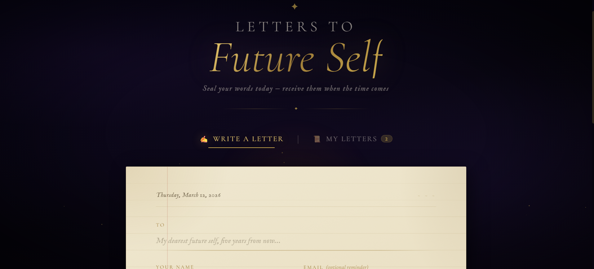

# Letters to Future Self

I've always journaled. There's something about writing to a future version of yourself that hits differently. 
Futureme.org does this but I wanted to build my own, something that actually feels like writing a letter.

So here it is. Write, pick a date, seal it. Open it when the time comes.

---

## Things to know

- Letters are saved in your browser's `localStorage` — they never leave your machine
- Pushing to GitHub won't expose them to anyone
- Clearing browser data will delete them, so don't

No accounts, no backend, no email delivery (yet). Just three files — open `index.html` and go.
